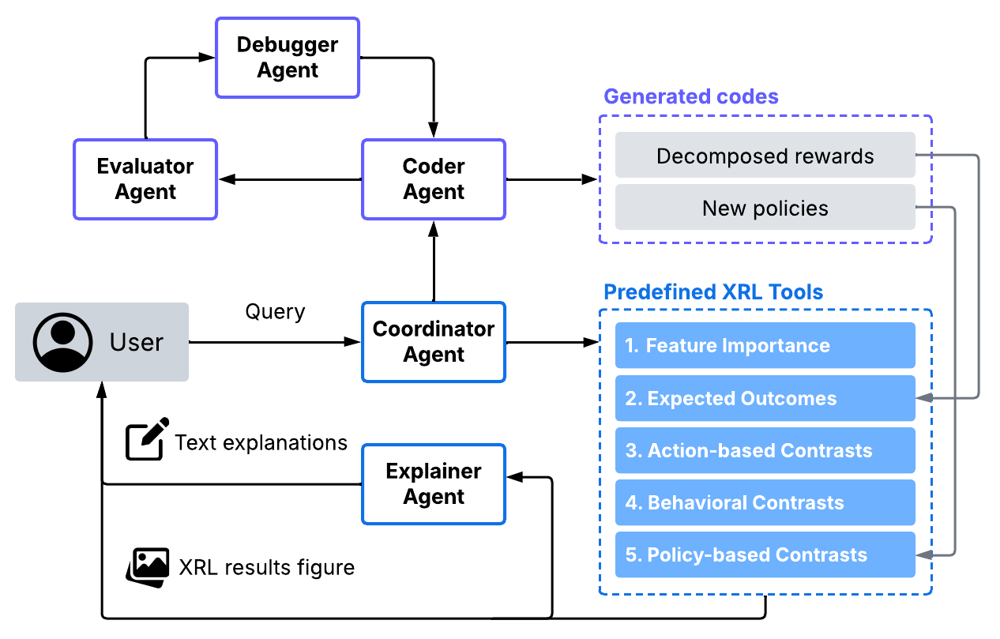
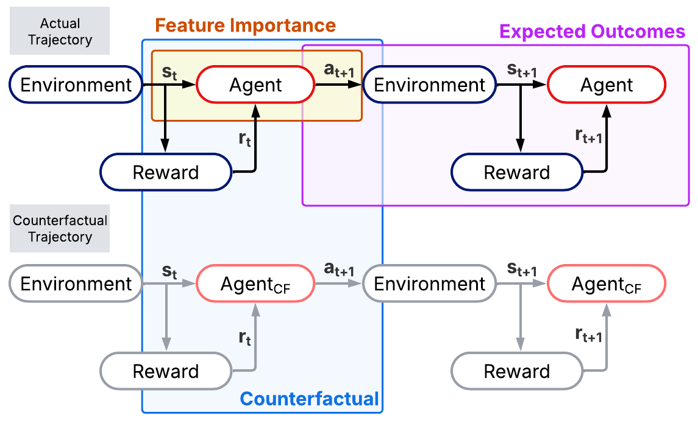
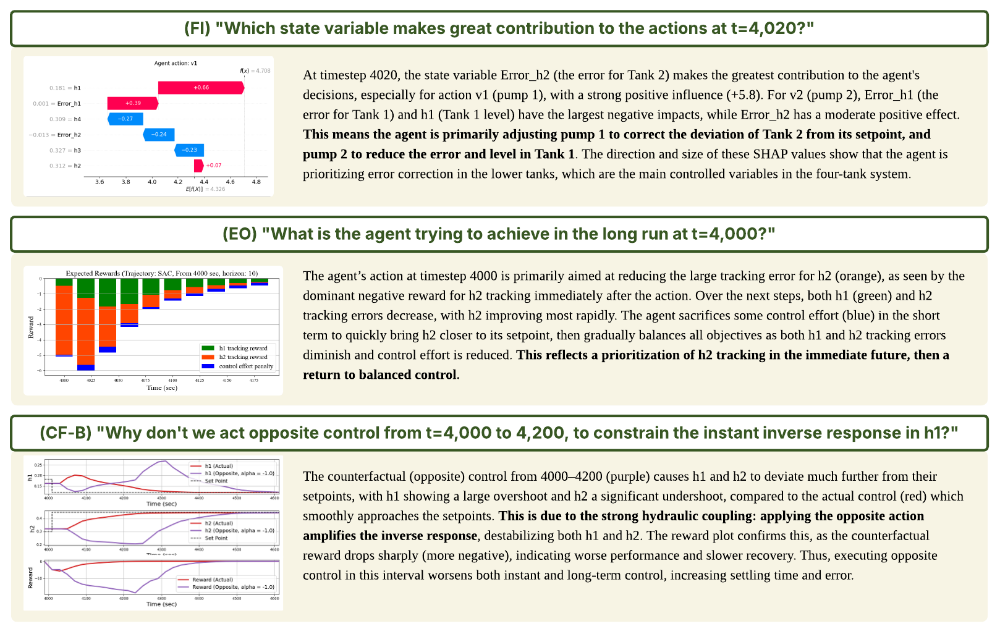

# TalkToAgent

Welcome to the TalkToAgent page.
**TalkToAgent** is a human-centric explainer that connects natural language queries to a range of explainable reinforcement learning (XRL) techniques,
enabling domain experts to better understand complex RL agent behavior.

---

## 1. Motivation

While Explainable Reinforcement Learning (XRL) has improved the transparency of RL agents, its usability remains limited, especially for non-experts.
Existing tools often assume users to understand which explanation technique to use and how to interpret its results.
TalkToAgent bridges this gap by interpreting user queries in natural language and returning task-appropriate XRL explanations in both textual and visual forms.

---

## 2. Methodology

<a name="chat-example"></a>
<p align="center">

</p>

_TalkToAgent_ is a multi-agent Large Language Model (LLM) framework that delivers interactive, natural language explanations for RL policies.
With five specialized LLM agents, it can generate multimodal explanations to various types of user queries related to RL systems.

- **Coordinator Agent**: Maps user queries into appropriate predefined XRL functions.
- **Coder Agent**: Generates python codes of executable policies or modified rewards.
- **Evaluator Agent**: Validates whether the execution aligns with user intent.
- **Debugger Agent**: Diagnoses error messages and creates guidance to correct them.
- **Explainer Agent**: Offers domain-specific natural language explanations of the XRL visualization results.

TalkToAgent integrates the following types of XRL queries and maps them to relevant predefined XRL functions.

<a name="chat-example"></a>
<p align="center">

</p>

1. **Feature Importance (FI)**  
  FI explanations aim to identify which aspects of the **current state** most influence the agent’s specific action.  
  _Example:_ “Which state variable most affects the current action?”

2. **Expected Outcome (EO)**  
  EO explanations aim to explain an agent's behavior by analyzing **anticipated future trajectories** or rewards as a result of executing a particular action.  
  _Example:_ “What is the agent trying to achieve by doing this action?”

3. **Contrastive Explanations (CE)**  
  CE approaches aim to answer **contrastive questions** such as "What if?" or "Why not?",
  highlighting why the agent selected the current action over plausible alternatives.  
  In TalkToAgent, three novel types of contrastive explanations are introduced to enhance the flexibility of contrastive reasoning in RL practices.  
   1) **Action-based Contrastive Explanations (CE-A)**    
     CE-A approach poses contrastive actions for a certain timestep.  
     _Example:_ “Why don't we take action b, instead of action a at time t?”

   2) **Behavior-based Contrastive Explanations (CE-B)**  
      CE-B approach constructs contrastive scenarios from qualitative descriptions about agent behavior.
      Terms like _aggressive_ or _opposite_ are translated to contrastive trajectories by using the idea of Polyak averaging.  
      _Example:_ “Why don't we take a more conservative control from t=4000 to 4200?”
   
   3) **Policy-based Contrastive Explanations (CE-P)**  
      CE-P approach addresses a broader question of how a fundamentally different control strategy would affect future trajectories, rather than just a localized action deviation.  
      _Example:_ "What would happen if we replaced the current RL policy with an on-off controller from t=4000 to 4200?"

---

## 3. Demonstration

### Setup

```bash
# Install dependencies
pip install -r requirements.txt
```

Since this project relies on the OpenAI API, please create a .env file inside the project folder (if it doesn’t exist) and add the following line:
```bash
OPENAI_API_KEY='YOUR_OPENAI_API_KEY'
```


### Code Description
- **Main codes**
  - **[RQ1] Tool selection.py**: Measures accuracy of calling relevant XRL functions with correct arguments. (Table 2 in main paper)
  - **[RQ2-1] CE generation.py**: Generates different types of contrastive trajectories from user queries. (Figure 4 in main paper)
  - **[RQ2-2] Policy code generation.py**: Assesses reliability of generating contrastive scenarios. (Figure 5 in main paper)
  - **[RQ3] Explanation quality.py**: Generates XRL explanations from different types of user queries (Figure 6 in main paper)

Please note that [RQ2-2] may consume a large number of tokens, as the process involves multiple iterations of code generation, validation, and debugging using the LLM model.

### Example results

<a name="chat-example"></a>
<p align="center">

</p>
 
## 4. Citation

If you find this work useful in your research, please cite us:
